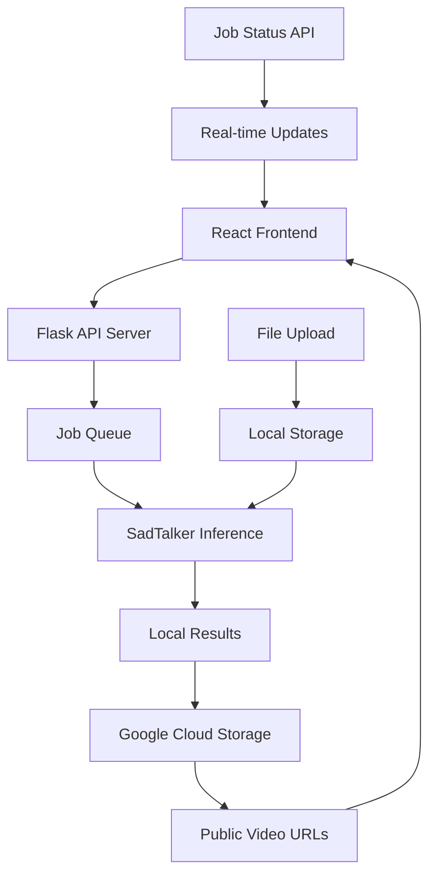
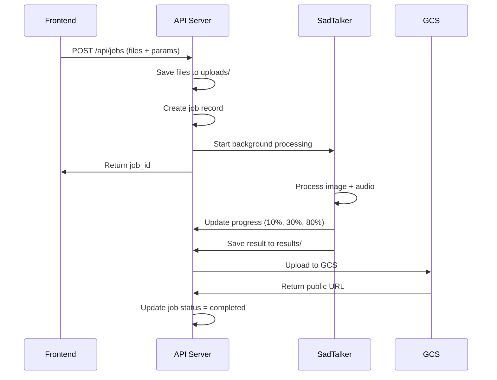
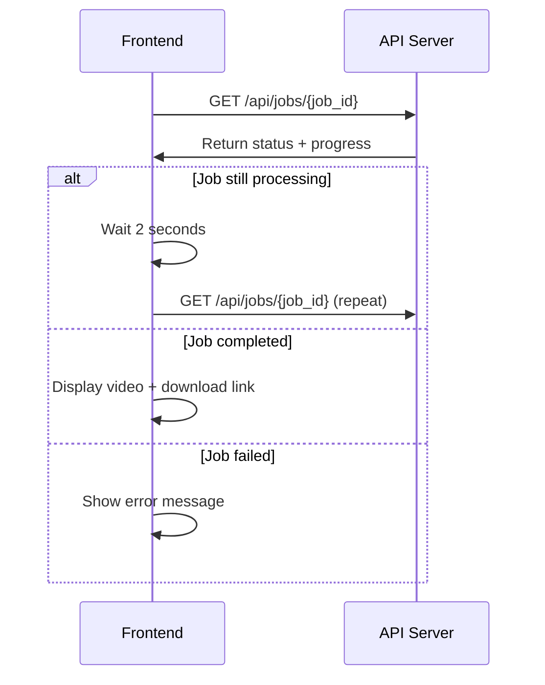

# 🎭 SadTalker API - Comprehensive Documentation

## 📋 Table of Contents
1. [System Overview](#system-overview)
2. [Architecture](#architecture)
3. [API Endpoints](#api-endpoints)
4. [Frontend Integration](#frontend-integration)
5. [Data Flow](#data-flow)
6. [Google Cloud Storage Integration](#google-cloud-storage-integration)
7. [Error Handling](#error-handling)
8. [Deployment Guide](#deployment-guide)
9. [Testing](#testing)
10. [Troubleshooting](#troubleshooting)

---

## 🚀 System Overview

The SadTalker API is a comprehensive system for generating talking face videos from static images and audio files. It combines:

- **Backend API Server** (`real_api_server.py`) - Flask-based REST API
- **React Frontend** (`sadtalker-frontend-demo/`) - Modern web interface
- **Google Cloud Storage** - Cloud-based file storage and delivery
- **SadTalker AI Model** - Core video generation engine

### Key Features
- ✅ Asynchronous job processing
- ✅ Real-time progress tracking
- ✅ Cloud storage integration
- ✅ Modern React frontend
- ✅ File upload and management
- ✅ Job status monitoring
- ✅ Video streaming and download

---

## 🏗️ Architecture



### Component Details

#### 1. **Flask API Server** (`real_api_server.py`)
- **Port**: 7860
- **Framework**: Flask with CORS support
- **Storage**: In-memory job tracking
- **Processing**: Background threading for inference

#### 2. **React Frontend** (`sadtalker-frontend-demo/`)
- **Framework**: React 18
- **Styling**: Custom CSS with modern design
- **State Management**: React hooks
- **API Integration**: Fetch API with polling

#### 3. **Google Cloud Storage**
- **Bucket**: `gcs-vodacast-bucket`
- **Authentication**: Service account JSON
- **Features**: Public file access, automatic upload

---

## 🔌 API Endpoints

### Base URL
```
http://localhost:7860
```

### 1. Health Check
```http
GET /api/health
```

**Purpose**: Verify API server status and get system information

**Response**:
```json
{
  "status": "healthy",
  "message": "SadTalker API is running",
  "timestamp": 1757876421.1140838,
  "active_jobs": 0
}
```

**Frontend Integration**:
```javascript
const checkHealth = async () => {
  try {
    const response = await fetch(`${API_BASE_URL}/api/health`);
    const data = await response.json();
    setHealthStatus(data);
  } catch (error) {
    setHealthStatus({ status: 'error', message: 'API not reachable' });
  }
};
```

---

### 2. Create Job
```http
POST /api/jobs
Content-Type: multipart/form-data
```

**Purpose**: Create a new talking face video generation job

**Required Parameters**:
| Field | Type | Description |
|-------|------|-------------|
| `source_image` | File | Image file (PNG, JPG, JPEG) |
| `driven_audio` | File | Audio file (WAV, MP3, MP4) |

**Optional Parameters**:
| Field | Type | Default | Description |
|-------|------|---------|-------------|
| `preprocess` | String | "crop" | Image preprocessing method |
| `still_mode` | String | "false" | Use still mode for generation |
| `use_enhancer` | String | "false" | Enable face enhancement |
| `batch_size` | String | "1" | Processing batch size |
| `size` | String | "256" | Output video size (256/512) |
| `pose_style` | String | "0" | Pose style (0-45) |

**Response**:
```json
{
  "job_id": "a8435aad-1a00-4eb0-b751-282b30d2b21e",
  "status": "created",
  "message": "Job created successfully"
}
```

**Frontend Integration**:
```javascript
const createJob = async (e) => {
  e.preventDefault();
  
  const jobFormData = new FormData();
  jobFormData.append('source_image', formData.source_image);
  jobFormData.append('driven_audio', formData.driven_audio);
  
  // Add parameters
  Object.keys(formData).forEach(key => {
    if (key !== 'source_image' && key !== 'driven_audio') {
      jobFormData.append(key, formData[key]);
    }
  });

  try {
    const response = await fetch(`${API_BASE_URL}/api/jobs`, {
      method: 'POST',
      body: jobFormData
    });

    const data = await response.json();
    
    if (response.ok) {
      toast.success('Job created successfully!');
      setSelectedJob(data);
      startPolling(data.job_id);
    }
  } catch (error) {
    toast.error('Failed to create job');
  }
};
```

---

### 3. Get Job Status
```http
GET /api/jobs/{job_id}
```

**Purpose**: Retrieve current status and progress of a specific job

**Response**:
```json
{
  "job_id": "a8435aad-1a00-4eb0-b751-282b30d2b21e",
  "status": "completed",
  "progress": 100,
  "created_at": 1757876421.1140838,
  "preprocess": "crop",
  "still_mode": "false",
  "use_enhancer": "false",
  "batch_size": "1",
  "size": "256",
  "pose_style": "0",
  "image_path": "uploads/...",
  "audio_path": "uploads/...",
  "result_path": "results/.../output.mp4",
  "s3_url": "https://storage.googleapis.com/..."
}
```

**Job Status Flow**:
```
created → processing → completed
    ↓         ↓           ↓
  0%        10-90%      100%
```

**Frontend Integration**:
```javascript
const startPolling = (jobId) => {
  setPollingJobs(prev => new Set([...prev, jobId]));
  
  const pollInterval = setInterval(async () => {
    try {
      const response = await fetch(`${API_BASE_URL}/api/jobs/${jobId}`);
      const data = await response.json();
      
      if (data.status === 'completed' || data.status === 'failed') {
        clearInterval(pollInterval);
        setPollingJobs(prev => {
          const newSet = new Set(prev);
          newSet.delete(jobId);
          return newSet;
        });
        
        if (data.status === 'completed') {
          toast.success('Job completed successfully!');
        } else {
          toast.error('Job failed: ' + (data.error || 'Unknown error'));
        }
      }
    } catch (error) {
      console.error('Error polling job status:', error);
    }
  }, 2000);
};
```

---

### 4. List All Jobs
```http
GET /api/jobs
```

**Purpose**: Retrieve all jobs in the system

**Response**:
```json
{
  "jobs": [
    {
      "job_id": "a8435aad-1a00-4eb0-b751-282b30d2b21e",
      "status": "completed",
      "progress": 100,
      "created_at": 1757876421.1140838,
      "s3_url": "https://storage.googleapis.com/..."
    }
  ],
  "total": 1
}
```

**Frontend Integration**:
```javascript
const loadJobs = async () => {
  try {
    const response = await fetch(`${API_BASE_URL}/api/jobs`);
    const data = await response.json();
    setJobs(data.jobs || []);
  } catch (error) {
    toast.error('Failed to load jobs');
  }
};
```

---

### 5. Download Result Files
```http
GET /api/results/{job_id}/{filename}
```

**Purpose**: Download generated video files

**Frontend Integration**:
```javascript
// Direct video display
{videoUrl && (
  <div className="video-container">
    <h3>Generated Video</h3>
    <video controls width="100%" maxWidth="600">
      <source src={videoUrl} type="video/mp4" />
      Your browser does not support the video tag.
    </video>
    <br />
    <a 
      href={videoUrl} 
      download="talking_face_video.mp4"
      className="btn btn-success"
    >
      📥 Download Video
    </a>
  </div>
)}
```

---

## 🎨 Frontend Integration

### React Component Structure

The frontend is built with modern React patterns:

#### 1. **State Management**
```javascript
const [formData, setFormData] = useState({
  source_image: null,
  driven_audio: null,
  preprocess: 'crop',
  still_mode: 'false',
  use_enhancer: 'false',
  batch_size: '1',
  size: '256',
  pose_style: '0'
});

const [jobs, setJobs] = useState([]);
const [selectedJob, setSelectedJob] = useState(null);
const [pollingJobs, setPollingJobs] = useState(new Set());
```

#### 2. **File Upload Handling**
```javascript
const handleFileUpload = (field, file) => {
  setFormData(prev => ({
    ...prev,
    [field]: file
  }));
};

// In JSX
<input
  type="file"
  accept="image/*"
  onChange={(e) => handleFileUpload('source_image', e.target.files[0])}
/>
```

#### 3. **Real-time Status Updates**
```javascript
// Automatic polling for active jobs
useEffect(() => {
  const interval = setInterval(() => {
    pollingJobs.forEach(jobId => {
      getJobStatus(jobId);
    });
  }, 2000);
  
  return () => clearInterval(interval);
}, [pollingJobs]);
```

#### 4. **Progress Visualization**
```javascript
{selectedJob.status === 'processing' && (
  <div className="progress-container">
    <div className="progress-bar">
      <div 
        className="progress-fill" 
        style={{ width: `${selectedJob.progress}%` }}
      ></div>
    </div>
    <div className="progress-text">{selectedJob.progress}% Complete</div>
  </div>
)}
```

### UI Components

#### 1. **Tabbed Interface**
- 🚀 Create Job
- 📋 All Jobs  
- 📊 Job Status
- ❤️ Health Check

#### 2. **File Upload Interface**
- Drag-and-drop file selection
- File type validation
- Parameter configuration
- Real-time feedback

#### 3. **Job Management**
- Job list with status indicators
- Progress bars for active jobs
- Download links for completed jobs
- Delete functionality

---

## 🔄 Data Flow

### 1. Job Creation Flow


### 2. Status Polling Flow


---

## ☁️ Google Cloud Storage Integration

### Configuration
```python
# GCS Setup in real_api_server.py
GCS_BUCKET_NAME = "gcs-vodacast-bucket"
GCS_CREDENTIALS_FILE = os.path.join(os.getcwd(), "gcs_credentials.json")

def upload_to_gcs(local_file, bucket_name, destination_blob):
    client = storage.Client.from_service_account_json(GCS_CREDENTIALS_FILE)
    bucket = client.bucket(bucket_name)
    blob = bucket.blob(destination_blob)
    blob.upload_from_filename(local_file)
    
    # Make the file public
    blob.make_public()
    
    return blob.public_url
```

### Upload Process
1. **Local Processing**: SadTalker generates video locally
2. **GCS Upload**: Video uploaded to `{job_id}/output.mp4`
3. **Public Access**: File made publicly accessible
4. **URL Return**: Public URL returned to frontend

### Benefits
- ✅ Scalable storage
- ✅ Global CDN access
- ✅ No server storage limits
- ✅ Direct video streaming

---

## 🚨 Error Handling

### API Error Responses
```json
{
  "error": "Both source_image and driven_audio files are required"
}
```

```json
{
  "error": "Invalid file type"
}
```

```json
{
  "error": "Job not found"
}
```

### Frontend Error Handling
```javascript
const handleApiCall = async (url, options = {}) => {
  try {
    const response = await fetch(url, options);
    
    if (!response.ok) {
      const errorData = await response.json();
      throw new Error(errorData.error || `HTTP error! status: ${response.status}`);
    }
    
    return await response.json();
  } catch (error) {
    console.error('API Error:', error);
    toast.error('Error: ' + error.message);
    throw error;
  }
};
```

### Common Error Scenarios
1. **File Upload Errors**
   - Invalid file types
   - File size limits
   - Network timeouts

2. **Processing Errors**
   - SadTalker inference failures
   - Insufficient resources
   - Model loading issues

3. **Storage Errors**
   - GCS authentication failures
   - Upload timeouts
   - Permission issues

---

## 🚀 Deployment Guide

### 1. Backend Deployment

#### Prerequisites
```bash
pip install -r requirements.txt
```

#### Environment Setup
```bash
# Set up GCS credentials
export GOOGLE_APPLICATION_CREDENTIALS="path/to/gcs_credentials.json"

# Start the server
python real_api_server.py
```

#### Production Configuration
```python
# In real_api_server.py
app.run(host='0.0.0.0', port=7860, debug=False)
```

### 2. Frontend Deployment

#### Development
```bash
cd sadtalker-frontend-demo
npm install
npm start
```

#### Production Build
```bash
npm run build
# Serve the build folder with a web server
```

### 3. Google Cloud Setup

#### Create Service Account
1. Go to Google Cloud Console
2. Create new service account
3. Download JSON credentials
4. Place in project root as `gcs_credentials.json`

#### Bucket Configuration
```bash
# Create bucket
gsutil mb gs://gcs-vodacast-bucket

# Set public access
gsutil iam ch allUsers:objectViewer gs://gcs-vodacast-bucket
```

---

## 🧪 Testing

### 1. API Testing with Postman
- Import `SadTalker_API_Postman_Collection.json`
- Test all endpoints with sample files
- Verify file upload and processing

### 2. Frontend Testing
```bash
# Run frontend tests
cd sadtalker-frontend-demo
npm test
```

### 3. Integration Testing
```javascript
// Test complete workflow
async function testCompleteWorkflow() {
  // 1. Health check
  const health = await fetch('/api/health');
  
  // 2. Create job
  const formData = new FormData();
  formData.append('source_image', imageFile);
  formData.append('driven_audio', audioFile);
  
  const job = await fetch('/api/jobs', {
    method: 'POST',
    body: formData
  });
  
  // 3. Poll for completion
  const jobId = job.job_id;
  let status = 'processing';
  
  while (status === 'processing') {
    await new Promise(resolve => setTimeout(resolve, 2000));
    const statusResponse = await fetch(`/api/jobs/${jobId}`);
    status = statusResponse.status;
  }
  
  // 4. Verify result
  assert(status === 'completed');
  assert(statusResponse.s3_url);
}
```

---

## 🔧 Troubleshooting

### Common Issues

#### 1. **Server Won't Start**
```bash
# Check port availability
netstat -an | grep 7860

# Check Python dependencies
pip list | grep flask
```

#### 2. **File Upload Fails**
- Verify file types are supported
- Check file size limits
- Ensure uploads directory exists

#### 3. **GCS Upload Errors**
```python
# Check credentials
import os
print(os.path.exists('gcs_credentials.json'))

# Test GCS connection
from google.cloud import storage
client = storage.Client.from_service_account_json('gcs_credentials.json')
```

#### 4. **Frontend Connection Issues**
```javascript
// Check API base URL
const API_BASE_URL = 'http://localhost:7860';

// Verify CORS settings
// In real_api_server.py: CORS(app)
```

#### 5. **Job Processing Stuck**
- Check SadTalker model files in `checkpoints/`
- Verify inference.py is working
- Check system resources (CPU/Memory)

### Debug Mode
```python
# Enable debug logging
import logging
logging.basicConfig(level=logging.DEBUG)

# In real_api_server.py
app.run(debug=True)
```

---

## 📊 Performance Optimization

### 1. **Backend Optimizations**
- Use Redis for job queue (instead of in-memory)
- Implement job cleanup after completion
- Add request rate limiting
- Use async processing with Celery

### 2. **Frontend Optimizations**
- Implement virtual scrolling for large job lists
- Add image compression before upload
- Use WebSocket for real-time updates
- Implement offline support

### 3. **Storage Optimizations**
- Implement file compression
- Use CDN for video delivery
- Add automatic cleanup of old files
- Implement file deduplication

---

## 🔒 Security Considerations

### 1. **API Security**
- Add authentication/authorization
- Implement rate limiting
- Validate file types and sizes
- Sanitize user inputs

### 2. **File Security**
- Scan uploaded files for malware
- Implement file size limits
- Use secure file storage
- Add access controls

### 3. **Frontend Security**
- Implement CSRF protection
- Use HTTPS in production
- Validate all user inputs
- Implement proper error handling

---

## 📈 Monitoring and Analytics

### 1. **API Metrics**
- Request/response times
- Job success/failure rates
- File upload/download statistics
- Error rates and types

### 2. **System Metrics**
- CPU/Memory usage
- Disk space utilization
- Network bandwidth
- GCS storage costs

### 3. **User Analytics**
- Job creation patterns
- Feature usage statistics
- Error frequency
- Performance metrics

---

## 🎯 Future Enhancements

### 1. **API Improvements**
- WebSocket support for real-time updates
- Batch job processing
- Job scheduling
- Advanced video processing options

### 2. **Frontend Features**
- Drag-and-drop file upload
- Video preview before processing
- Batch job management
- User authentication

### 3. **Infrastructure**
- Kubernetes deployment
- Auto-scaling
- Load balancing
- Multi-region deployment

---

## 📞 Support and Maintenance

### 1. **Logging**
```python
import logging

# Configure logging
logging.basicConfig(
    level=logging.INFO,
    format='%(asctime)s - %(name)s - %(levelname)s - %(message)s',
    handlers=[
        logging.FileHandler('sadtalker_api.log'),
        logging.StreamHandler()
    ]
)
```

### 2. **Health Monitoring**
```python
@app.route('/api/health/detailed')
def detailed_health():
    return jsonify({
        'status': 'healthy',
        'timestamp': time.time(),
        'active_jobs': len([j for j in jobs.values() if j['status'] == 'processing']),
        'total_jobs': len(jobs),
        'disk_usage': get_disk_usage(),
        'memory_usage': get_memory_usage()
    })
```

### 3. **Backup Strategy**
- Regular database backups
- GCS bucket versioning
- Configuration file backups
- Log file rotation

---

This comprehensive documentation covers all aspects of your SadTalker API system, from basic usage to advanced deployment scenarios. The system demonstrates a well-architected solution for AI-powered video generation with modern web technologies.
